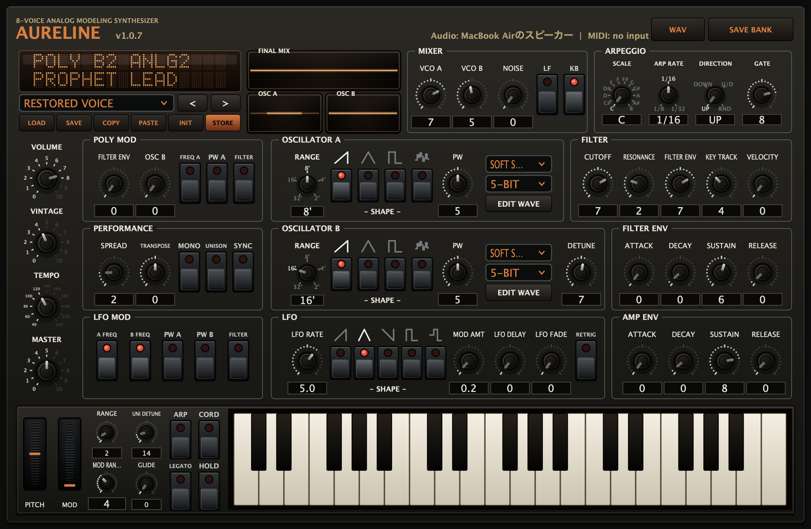
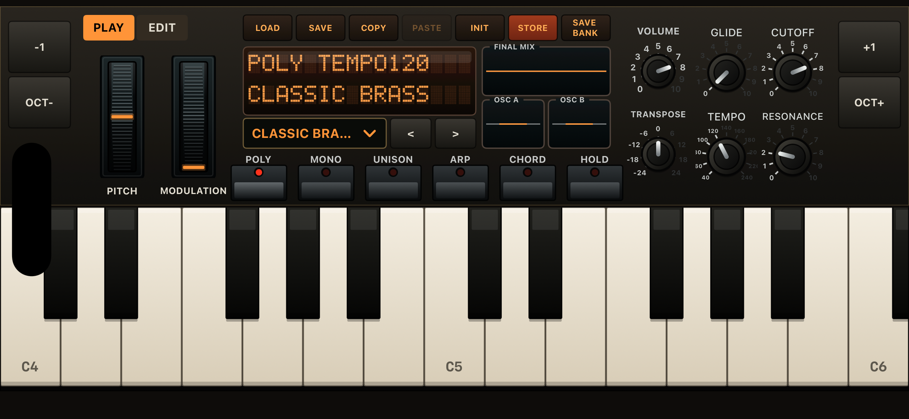

# Aureline

[日本語](README_ja.md)

Aureline is an eight-voice analog-modeling synthesizer by Hidecade Instruments.
It combines a direct, classic polysynth workflow with Aureline's own sound
engine, interface, Wave Memory oscillators, and voice library.

Current release: [v1.0.7](https://github.com/Hidecade/Aureline/releases/tag/v1.0.7)





## Highlights

- Eight-voice polyphony with Poly, Mono Legato, and Unison modes
- Two band-limited oscillators per voice plus noise
- Saw, triangle, pulse, and 32-step Wave Memory waveforms
- Hard sync, pulse-width modulation, oscillator detune, and low-frequency mode
- Voice-local Poly Mod from Oscillator B and the filter envelope
- Poly Mod routing to Oscillator A frequency, pulse width, and filter cutoff
- Aureline four-stage OTA low-pass filter with resonance and self-oscillation
- Dedicated filter and amplifier ADSR envelopes
- Multi-wave LFO with delay, fade, retrigger, and selectable destinations
- Stereo spread, vintage voice variation, glide, pitch bend, and mod wheel
- Arpeggiator, chord mode, hold, tempo, direction, gate, and scale root
- Four writable 32-voice banks: Analog 1, Analog 2, Retro, and 8-Bit
- Cross-platform voice and bank files
- 24-bit stereo WAV recording in the macOS and Windows standalone apps

## Formats

| Platform | Formats |
|---|---|
| macOS | Standalone, VST3, Audio Unit |
| Windows | Standalone, VST3 |
| iPhone | Standalone app, AUv3 Instrument |

The desktop formats use the same JUCE processor, synthesis engine, MIDI path,
state format, and performance interface. The iPhone app and AUv3 use a native
SwiftUI interface and Apple audio integration while sharing the C++ engine and
voice data with the desktop version.

## Synthesis architecture

```text
Oscillator A ─┐
Oscillator B ─┼─ Mixer ─ OTA 4-pole LPF ─ VCA ─ Voice Pan ─ Output
Noise ────────┘

LFO ──────── Oscillator A/B pitch, pulse width, filter cutoff
Poly Mod ─── Oscillator B + filter envelope
              └─ Oscillator A frequency / pulse width / filter cutoff
```

Oscillator B remains available as a Poly Mod source even when its mixer level
is zero. This supports subtle animation, audio-rate modulation, metallic tones,
and hard-sync sweeps without requiring Oscillator B in the final mix.

## Wave Memory

Oscillators A and B can mix a 32-step single-cycle Wave Memory waveform with
their analog waveforms. Sixteen factory wave memories are included, and the
editor can copy, paste, draw, and store user wave data as part of a voice.
Wave Memory follows oscillator range and Oscillator B detune; it can also act
as an audio-rate or low-frequency Poly Mod source.

## Voice library

Aureline provides four writable banks with 32 slots each:

1. Analog 1 — brass, strings/pads, piano/keys, bass, and effects
2. Analog 2 — leads, Poly Mod/sync, percussion, rhythm, and effects
3. Retro — compact vintage game and arcade-inspired sounds
4. 8-Bit — pulse, noise, wavetable, PSG, and expansion-style sounds

The last four slots of every bank are sound effects. STORE overwrites the
selected slot. SAVE exports the current voice without modifying the bank.
SAVE BANK exports all 32 slots, and LOAD asks which bank to replace when a
library is opened.

## File formats

| Data | Extension | Contents |
|---|---|---|
| Voice | `.aurelinevoice` | Cross-platform JSON voice including synthesis, performance, and Wave Memory data |
| Voice bank | `.aurelinelibrary.xml` | Version 2 XML library containing 32 voices |
| Wave Memory | `.aurelinewave` | Cross-platform 32-step waveform and character data |

Bundled, distributable library sources live in [`assets/`](assets/). Runtime
copies and user-edited banks are stored in each platform's application-support
location.

## Build

JUCE 8.0.14 is used for the desktop application and plug-ins. Put JUCE in
`external/JUCE`, set `AURELINE_JUCE_DIR`, or use the sibling OpalineFM checkout
during local development.

```sh
cmake -S . -B build -DAURELINE_BUILD_STANDALONE=ON -DAURELINE_BUILD_PLUGINS=ON
cmake --build build --config Release
```

Build the macOS Standalone, VST3, and Audio Unit installer packages into
`dist/` with:

```sh
./scripts/build-macos-installers.sh
```

For distribution signing, set `AURELINE_APPLICATION_SIGN_IDENTITY` and
`AURELINE_INSTALLER_SIGN_IDENTITY`. Without them, the script creates ad-hoc
signed packages for local testing.

Generate and build the iPhone/AUv3 project with:

```sh
cd iOS/AurelineMobile
xcodegen generate
xcodebuild \
  -project AurelineMobile.xcodeproj \
  -scheme AurelineMobile \
  -sdk iphonesimulator \
  -destination 'generic/platform=iOS Simulator' \
  -derivedDataPath ../../build/ios-mobile \
  CODE_SIGNING_ALLOWED=NO \
  build
```

Device archives require Apple signing for both the app and AUv3 extension.

## Tests

```sh
cmake -S . -B build -DBUILD_TESTING=ON
cmake --build build
ctest --test-dir build --output-on-failure
```

See [the Japanese product specification](docs/Aureline_Spec_ja.md) and
[the iOS specification](docs/Aureline_iOS_Spec_ja.md) for further technical
detail.
